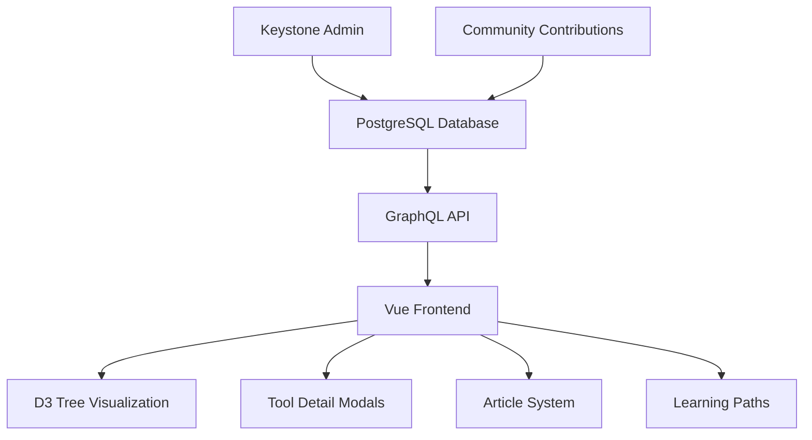

# OSINT Framework Enhanced Content Management System

## Overview

The OSINT Framework has been upgraded to a comprehensive, database-driven content management system that transforms static tool listings into a dynamic, educational platform.

## Current Architecture

### 🔧 **Backend (KeystoneJS + PostgreSQL)**
- **Database**: PostgreSQL with 1,104 tools and 190 categories
- **API**: GraphQL endpoint at `http://localhost:4000/api/graphql`
- **Admin Interface**: Available at `http://localhost:4000`
- **Content Management**: Rich text editor, media uploads, file management

### 🎨 **Frontend (Vue 3 + TypeScript)**
- **Tree Visualization**: D3.js-powered interactive node tree
- **Data Source**: Now connects to GraphQL API (was static JSON)
- **Dark Mode**: Complete dark/light theme support
- **Responsive Design**: Mobile-first, accessible interface

## Enhanced Content Management Features

### 📚 **Content Types**

#### 1. **Articles & Guides**
- Rich text content with formatting, layouts, images
- Tutorial system with difficulty levels
- Estimated reading time and prerequisites
- Related tools and cross-references
- Author attribution and publication workflow

#### 2. **Tool Documentation**
- **ToolGuides**: Comprehensive documentation for each tool
  - Getting Started guides
  - Advanced usage tutorials
  - API documentation
  - Troubleshooting guides
  - Best practices
  - Real-world use cases
- Screenshots, video embeds, code examples
- Step-by-step instructions with learning objectives

#### 3. **Interactive Learning System**
- **Learning Paths**: Structured curricula for OSINT skills
- **Difficulty Progression**: Beginner → Intermediate → Advanced → Expert
- **Prerequisites**: Clear requirements for each guide
- **Completion Tracking**: Progress monitoring and certificates
- **Estimated Duration**: Time investment for each learning path

#### 4. **Community Features**
- **Reviews & Ratings**: User feedback with verification
- **Contributions**: Community tool submissions and updates
- **Issue Reporting**: Bug reports and feature requests
- **Collaborative Editing**: Community-driven content improvement

#### 5. **Media Management**
- **File Storage**: Local storage for images, videos, documents
- **Asset Library**: Centralized media management
- **Rich Media**: Support for screenshots, diagrams, videos
- **Accessibility**: Alt text and accessibility features

### 🎯 **Blog System Capabilities**

#### **Content Creation**
```typescript
Article {
  title: "Advanced OSINT Techniques with Maltego"
  category: "tutorial" | "guide" | "review" | "news" | "case-study" | "methodology"
  content: RichTextDocument // Full editor with layouts, images, code blocks
  author: User
  relatedTools: [Tool] // Direct tool references
  tags: [ContentTag]
  difficultyLevel: "beginner" | "intermediate" | "advanced" | "expert"
  estimatedReadTime: 15 // minutes
  featuredImage: Image
  gallery: [Image]
}
```

#### **Content Discovery**
- **Categorization**: Tutorials, guides, reviews, news, case studies
- **Tagging System**: Flexible content organization
- **Search & Filter**: Advanced content discovery
- **Related Content**: AI-powered content recommendations
- **Featured Content**: Editorial content promotion

#### **User Experience**
- **Progressive Disclosure**: From basic tool info → detailed guides → advanced tutorials
- **Contextual Learning**: Tool-specific documentation and tutorials
- **Multi-format Content**: Text, images, videos, interactive demos
- **Offline Reading**: Downloadable guides and documentation

## Enhanced Tool Experience

### 🛠 **Tool Node Enhancement**

Instead of simple links, each tool now provides:

1. **Quick Overview** (Modal popup)
   - Basic information and description
   - Key features and use cases
   - Rating and community feedback
   - Quick start instructions

2. **Detailed Documentation** (Dedicated pages)
   - Comprehensive feature documentation
   - Step-by-step tutorials
   - Video demonstrations
   - Code examples and API docs

3. **Community Content**
   - User reviews and ratings
   - Community-contributed guides
   - Use case examples
   - Tips and best practices

4. **Learning Integration**
   - Related learning paths
   - Skill prerequisites
   - Difficulty assessment
   - Certification opportunities

### 📊 **Data Flow**



## Implementation Status

### ✅ **Completed**
- [x] Enhanced database schema with content management
- [x] GraphQL API with rich tool and content queries
- [x] Frontend integration with database
- [x] File storage and media management
- [x] Rich text editing capabilities
- [x] User authentication and roles
- [x] Community contribution system

### 🔄 **In Progress**
- [ ] Frontend components for enhanced tool modals
- [ ] Article and guide rendering system
- [ ] Learning path interfaces
- [ ] Media gallery components
- [ ] Review and rating system

### 📋 **Next Steps**

#### Phase 1: Enhanced Tool Experience (Week 1-2)
1. **Enhanced Tool Modal Component**
   - Tabbed interface: Overview | Guides | Reviews | Contribute
   - Rich content rendering
   - Interactive elements and media

2. **Tool Documentation System**
   - Guide creation and editing interface
   - Multi-format content support
   - Version control for documentation

#### Phase 2: Content Management (Week 3-4)
1. **Article System Frontend**
   - Blog-style article listing and reading
   - Rich text rendering with code highlighting
   - Author profiles and attribution

2. **Learning Path Interface**
   - Structured curriculum presentation
   - Progress tracking and completion
   - Interactive skill assessments

#### Phase 3: Community Features (Week 5-6)
1. **Review and Rating System**
   - User feedback collection
   - Rating aggregation and display
   - Moderation and verification tools

2. **Contribution Workflow**
   - Community tool submissions
   - Content improvement suggestions
   - Collaborative editing features

#### Phase 4: Advanced Features (Week 7-8)
1. **Search and Discovery**
   - Full-text search across all content
   - Intelligent recommendations
   - Personalized learning suggestions

2. **Analytics and Insights**
   - Usage tracking and analytics
   - Popular content identification
   - Learning path effectiveness

## Benefits of Enhanced System

### 🎓 **Educational Value**
- **Progressive Learning**: Users can start with basic tool info and advance to expert usage
- **Contextual Help**: Immediate access to relevant documentation
- **Skill Development**: Structured learning paths for OSINT proficiency
- **Community Knowledge**: Shared experiences and best practices

### 🚀 **User Experience**
- **Rich Interactions**: Beyond simple links to comprehensive tool exploration
- **Personalization**: Tailored content based on skill level and interests
- **Multi-modal Learning**: Text, video, interactive demos
- **Offline Capability**: Downloadable resources and guides

### 🏗 **Technical Advantages**
- **Scalable Architecture**: Database-driven with modern API
- **Content Versioning**: Track changes and improvements
- **SEO Optimization**: Rich content improves search visibility
- **Performance**: Efficient data loading and caching

### 🤝 **Community Building**
- **Knowledge Sharing**: User-generated content and guides
- **Quality Assurance**: Community review and verification
- **Continuous Improvement**: Feedback-driven content enhancement
- **Expertise Recognition**: Author profiles and contribution tracking

## Future Possibilities

- **AI-Powered Recommendations**: Personalized tool suggestions
- **Interactive Sandboxes**: Practice environments for tools
- **Certification System**: OSINT skill verification
- **Mobile Apps**: Native mobile experiences
- **API Ecosystem**: Third-party integrations and extensions
- **Multilingual Support**: International community expansion

---

**The OSINT Framework has evolved from a static directory to a comprehensive educational platform that empowers users to not just find tools, but master them.**
